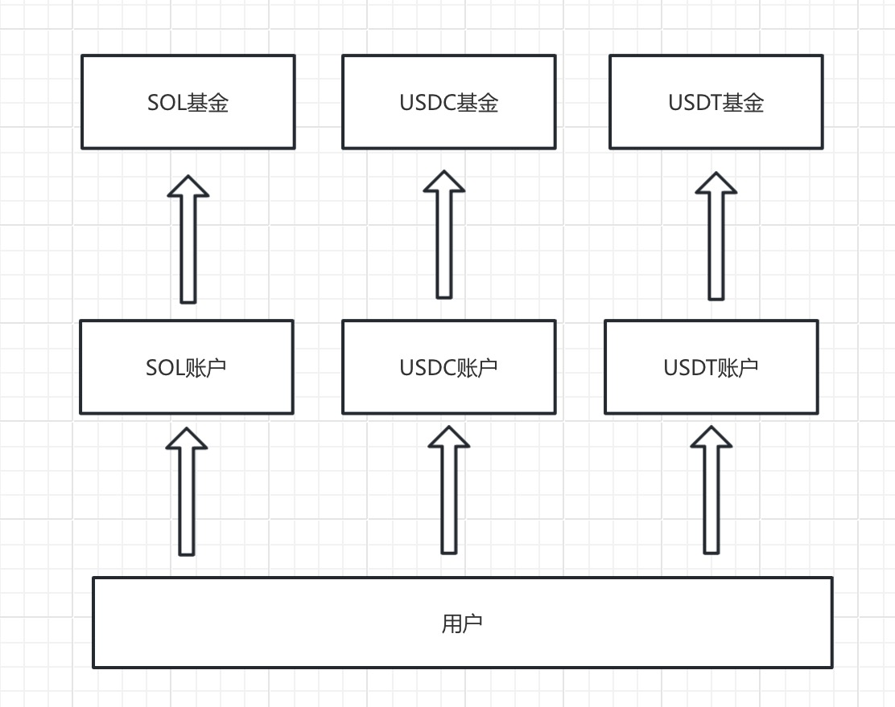

# 链上养老金

## 简介

这是在区块链上运作的养老金项目

## 流程

1. 用户创立养老金账户，选择每月存入多少 USDT、USDC、SOL，存多少年。

2. 到期要在 3 天内存入相应资金，不然账户关闭无法续期，需要手动领取全部资金。

3. 用户可以提前关闭账户，手动领取全部资金。

* 4. 用户可以在账户里选择投资池，按投资池利率和投资金额自动计算收益。

5. 账户到期后可以选择领取全部资金，或者按月分期领取资金。

## 示意图

## 优势

- 透明
资金数量和流向透明公开

- 安全
规则公开，不能随意修改

- 高收益
高于传统养老基金收益率

- 灵活
随时可以取用

## 运营模式

1. 质押收益收手续费

2. 与需要流动性的项目合作

3. 与投保团队合作

## 质押池

SOL: https://www.jito.network/zh/staking/ 7.2%

USDT: https://solend.fi/dashboard 5.1%

USDC: https://solend.fi/dashboard 5.9%

https://app.kamino.finance/

## 合约API

createAccount(tokenId, amount, months); // 创建账户

closeAccount(accountId);                // 关闭账户

renewAccount(accountId);                // 账户续保

changeAccount(accountId, months);       // 转成养老账户

receivinPension(accountId);             // 领取养老金

## 资料

[PPT](./链上养老金.pdf)

